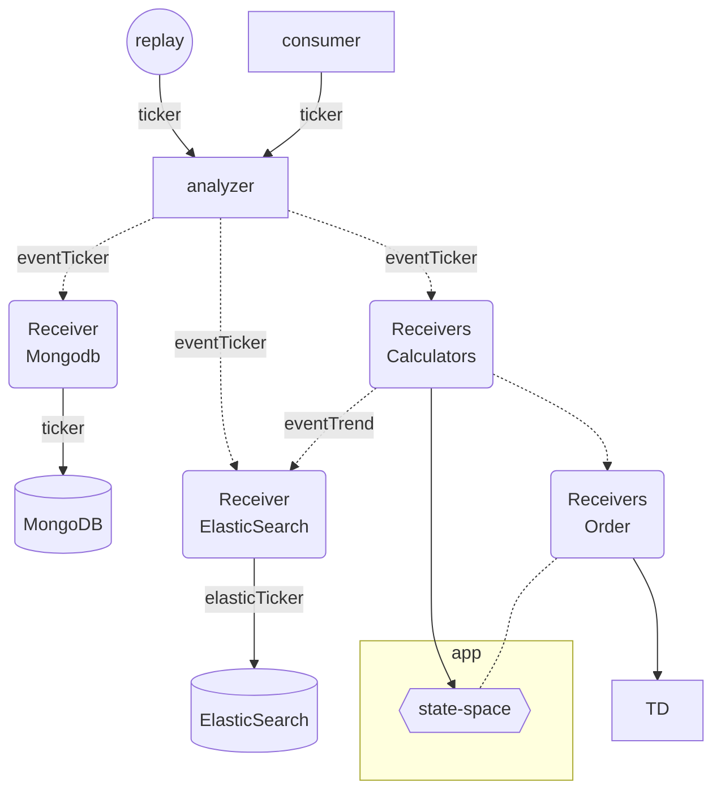

# Concept

```mermaid
graph TD

subgraph app
  state
end

mongodb[(MongoDB)]
elasticsearch[(ElasticSearch)]
state{{state-space}}

rx-mongo(Receiver<br/>Mongodb)
rx-elastic(Receiver<br/>ElasticSearch)
rx-calculator(Receivers<br/>Calculators)
rx-order(Receivers<br/>Order)


replay((replay))-- ticker -->analyzer
consumer-- ticker -->analyzer

analyzer-. eventTicker .->rx-mongo
rx-mongo-- ticker -->mongodb

analyzer-. eventTicker .->rx-elastic
rx-calculator-. eventTrend .->rx-elastic
rx-elastic-- elasticTicker -->elasticsearch

analyzer-. eventTicker .->rx-calculator
rx-calculator-->state
rx-calculator-.->rx-order

rx-order-.-state
rx-order-->TD
```