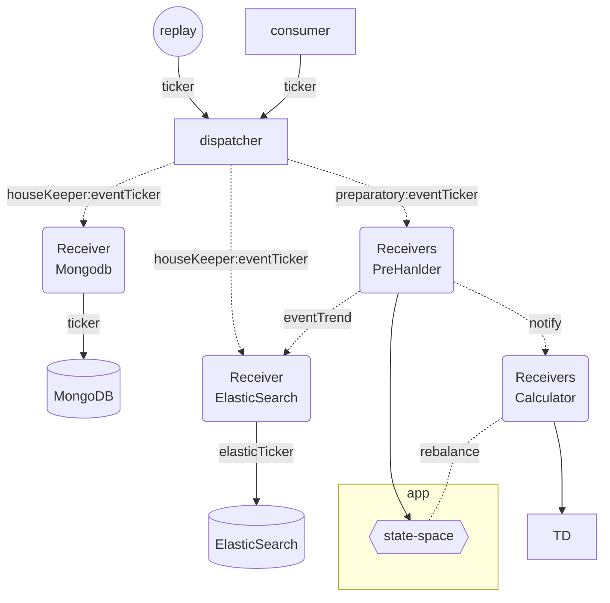

# Concept

```mermaid
graph TD

subgraph app
  state
end

mongodb[(MongoDB)]
elasticsearch[(ElasticSearch)]
state{{state-space}}

rx-mongo(Receiver<br/>Mongodb)
rx-elastic(Receiver<br/>ElasticSearch)
rx-calculator(Receivers<br/>PreHanlder)
rx-order(Receivers<br/>Calculator)


replay((replay))-- ticker -->dispatcher
consumer-- ticker -->dispatcher

dispatcher-. houseKeeper:eventTicker .->rx-mongo
rx-mongo-- ticker -->mongodb

dispatcher-. houseKeeper:eventTicker .->rx-elastic
rx-calculator-. eventTrend .->rx-elastic
rx-elastic-- elasticTicker -->elasticsearch

dispatcher-. preparatory:eventTicker .->rx-calculator
rx-calculator-->state
rx-calculator-. notify .->rx-order

rx-order-. rebalance .-state
rx-order-->TD
```