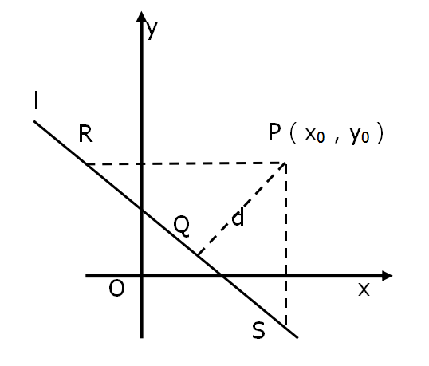

# 趨勢計算預測

## 平面上有限個點到直線的最短距離

> 假設直線不為垂直線（無斜率或斜率無限大）

定義直線 $ Ax + By + C = 0 $, 有限點為 $ (x_0, y_0), (x_1, y_1), .. , (x_n, y_n) $

求單點至直線距離（面積法）

定義直線上兩點 $ R(x_r, y_0), S(x_0, y_s) $，其中可知

$$ Ax_r + By_0 + C = 0 $$

與

$$ Ax_r + By_0 + C = 0 $$

即

$$ x_r = \frac{ -By_0 - C }{ A } $$

與

$$ y_s = \frac{ -Ax_0 - C }{ B } $$

由此可得水平距離為

$$ | PR | = | y_0 - \frac{ -Ax_0 - C }{ B } | = | \frac{ Ax_0 + By_0 + C }{ B } | $$

垂直距離為

$$ | PS | = | x_0 - \frac{ -By_0 - C }{ A } | = | \frac{ Ax_0 + By_0 + C }{ A } | $$

三角形長邊為

$$ | RS | = \sqrt{ |PR|^2 + |PS|^2 } = \frac{ \sqrt{ A^2 + B^2 } }{ AB } \cdot | Ax_0 + By_0 + C | $$

由三角形面積公式可得三角形斜邊高（即點至直線距離） $d$ 為

$$ d \cdot | RS | = | PR | \cdot | PS | $$

即

$$ d = \frac{ | PR | \cdot | PS | }{ | RS | } = \frac{ | Ax_0 + By_0 + C | }{ \sqrt{ A^2 + B^2 } } $$